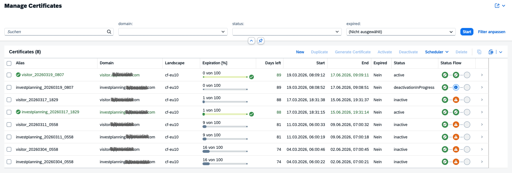
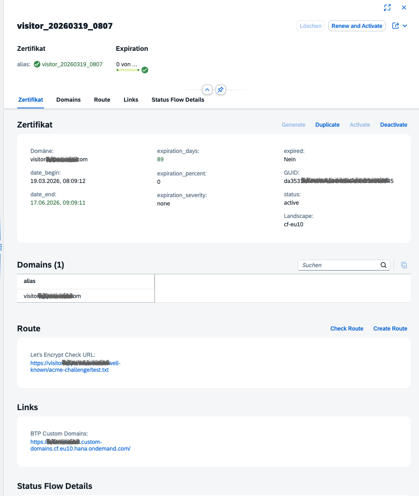
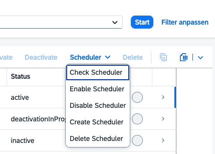
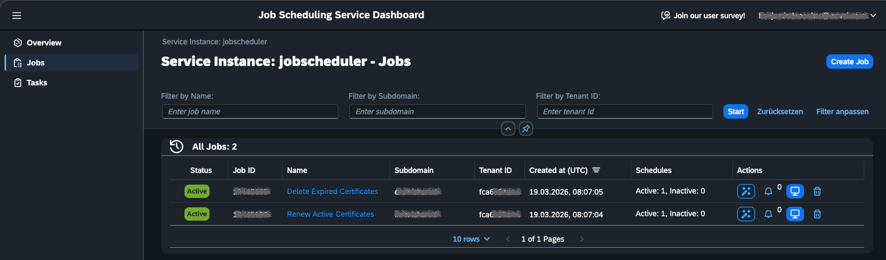
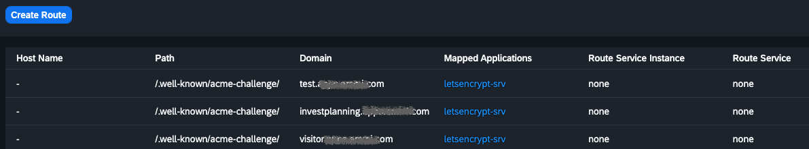
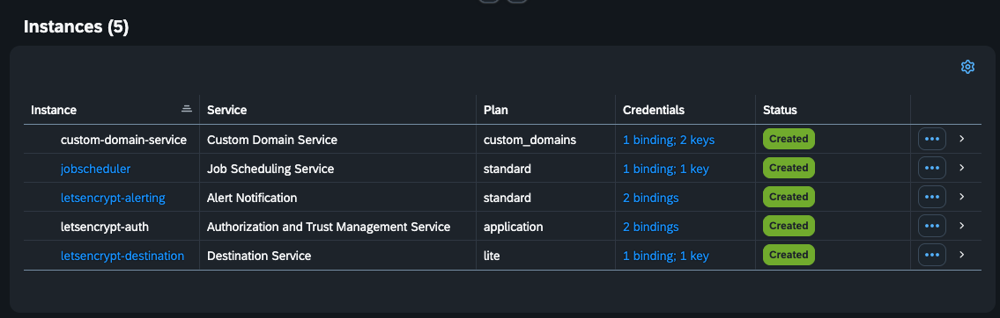

> **Open Source Contribution:** This project is community-driven and **Open Source**! 🚀  
> If you spot a bug or have an idea for a cool enhancement, your contributions are more than welcome. Feel free to open an **Issue** or submit a **Pull Request**.

# Let's Encrypt Certificate Automation for SAP BTP Custom Domains

## License
This project is licensed under the [MIT License](LICENSE).

## Table of Contents

- [Summary](#summary)
- [Project Overview](#project-overview)
- [What The Application Does](#what-the-application-does)
- [Logic In `srv/server.js`](#logic-in-srvserverjs)
- [Most Important Runtime Logic](#most-important-runtime-logic)
- [Important Technical Constraints](#important-technical-constraints)
- [Let's Encrypt Rate Limits and Test Mode](#lets-encrypt-rate-limits-and-test-mode)
- [Prerequisites](#prerequisites)
- [Manual Steps Before Productive Use](#manual-steps-before-productive-use)
- [How To Use The Application](#how-to-use-the-application)
- [Option 1: Productive usage on SAP BTP](#option-1-productive-usage-on-sap-btp)
- [Option 2: Local hybrid development](#option-2-local-hybrid-development)
- [Useful Commands](#useful-commands)
- [Project Structure](#project-structure)

## Summary

This application is used for fully automated certificate management with Let's Encrypt on SAP BTP Cloud Foundry.

App Overview



Certificate Details and Actions



Manage BTP scheduler job to automatically renew certificates



BTP Scheduler Jobs



It combines a CAP backend, a Fiori Elements UI, the SAP Custom Domain service, Cloud Foundry route management, and SAP Job Scheduler to support the full lifecycle of shared-domain certificates:

- create or recreate a CSR
- request a certificate from Let's Encrypt using the [HTTP-01 challenge](https://letsencrypt.org/docs/challenge-types/#http-01-challenge)
- upload the certificate chain to SAP Custom Domain service
- activate the certificate for a custom domain
- renew active certificates automatically on a schedule
- delete expired certificates after a valid replacement exists

The main goal is to reduce manual certificate handling for custom domains hosted on SAP BTP while keeping the operational flow transparent in a UI.


Reference SAP documentation: [What Is Custom Domain?](https://help.sap.com/docs/custom-domain/custom-domain-manager/what-is-custom-domain)

### Core Trick: Route Only The ACME Challenge Path

The key trick behind the automation is the use of SAP BTP Cloud Foundry path-based routing for the ACME challenge. Instead of requiring the target business application itself to serve the Let's Encrypt validation file, this project creates a dedicated BTP route for the path `/.well-known/acme-challenge/` and points that path to this certificate application. Because of that, the ACME challenge can be answered here even when the actual productive application for the same custom domain is running in a different BTP space or even a different organization. In practice, the domain stays on the target application, while only the ACME challenge path is routed to this automation service.

```text
Example domain: shop.example.com

                        shop.example.com
                               |
                               v
                 +-----------------------------+
                 | SAP BTP route configuration |
                 | for the same custom domain  |
                 +-----------------------------+
                      |                     |
                      |                     |
       normal traffic |                     | ACME challenge only
       /*             |                     | /.well-known/acme-challenge/*
                      v                     v
      +---------------------------+   +------------------------------+
      | Business application      |   | Certificate automation app   |
      | another BTP space or org  |   | this project                 |
      | serves the actual app     |   | serves the ACME token file   |
      +---------------------------+   +------------------------------+

Result:
- users still reach the productive business application
- Let's Encrypt validation is answered by this certificate app
- only the ACME path is rerouted, not the whole domain
```



### Extension Landscapes Support

This application supports SAP BTP Extension Landscapes. However, because each landscape has its own dedicated load balancer, a separate instance of this certificate automation application must be deployed to each region.

The reason is technical: a DNS CNAME record for a custom domain points to a specific BTP load balancer. Since there is no shared load balancer across landscapes but instead one load balancer per landscape, each landscape requires its own certificate application instance to serve ACME challenges for domains in that region.

Reference: [Custom Domains in Extension Landscapes](https://help.sap.com/docs/custom-domain/custom-domain-manager/custom-domains-in-extension-landscapes)

**Deployment implication:** If your organization uses multiple Extension Landscapes (e.g., eu10, eu10-004, us10, etc.), deploy this application once per landscape so that ACME challenges can be served locally in each region.

## Project Overview

This project consists of three main parts:

- `srv/`: CAP service implementation with the certificate, route, Cloud Foundry, and scheduler logic
- `app/certificates/`: Fiori Elements UI for certificate operations and scheduler administration
- `mta.yaml`: deployment descriptor for SAP BTP Cloud Foundry including required managed services

Important implementation details:

- The CAP entities in `db/data-model.cds` are virtual (`@cds.persistence.skip`). The application does not manage certificates in a local database. Instead, it reads and controls certificates through external APIs.
- The UI is an OData V4 Fiori Elements app bound to `/catalog/`.
- Productive automation depends on service bindings to SAP BTP managed services, not on local mocks.

## What The Application Does

The central service is `CatalogService` in `srv/cat-service.cds` and `srv/cat-service.js`.

It exposes actions and functions for:

- reading available certificates, routes, domains, statuses, and environments
- creating a new key and CSR for a domain
- recreating a CSR from an existing certificate alias
- requesting a Let's Encrypt certificate in staging or production mode
- validating and uploading the certificate chain to SAP Custom Domain service
- activating and deactivating server certificates
- creating and checking the public HTTP-01 challenge route in Cloud Foundry
- creating, enabling, disabling, checking, and deleting Job Scheduler jobs
- renewing all active certificates automatically
- deleting obsolete expired certificates automatically

The implementation talks to several external APIs:

- SAP Custom Domain service API for keys, CSRs, server certificates, domains, and TLS configuration
- SAP Destination service to retrieve the technical destination for the Cloud Foundry API
- Cloud Foundry API to create and bind the ACME challenge route
- SAP Job Scheduler API to create and operate weekly background jobs
- Let's Encrypt via `acme-client` to complete the ACME flow

## Logic In `srv/server.js`

`srv/server.js` is intentionally small, but it is critical for the certificate flow.

On CAP bootstrap, it registers a static Express middleware for `srv/static` before the regular CAP middleware stack. That makes the path `/.well-known/acme-challenge/` publicly reachable and not protected by XSUAA.

Why this matters:

- Let's Encrypt must be able to fetch the HTTP-01 challenge file anonymously
- the challenge files are written dynamically by the CAP service into `srv/static/.well-known/acme-challenge/`
- if this path were protected by authentication, certificate issuance would fail

In short, `srv/server.js` provides the public ACME challenge endpoint that the rest of the automation depends on.

## Most Important Runtime Logic

The main business logic is implemented in `srv/cat-service.js`.

### 1. Certificate creation

For a new or existing domain, the service can create a key and CSR via SAP Custom Domain service.

Then it:

- selects the Let's Encrypt environment: staging (`T`) or production (`P`)
- verifies that the public challenge route is reachable
- requests a certificate with `acme-client`
- writes the ACME token file during `challengeCreateFn`
- removes the challenge file again during `challengeRemoveFn`
- splits the returned certificate chain
- validates the certificate chain with SAP Custom Domain service
- uploads the certificate chain
- activates the certificate in production mode

### 2. Route handling

The application can verify or create the HTTP route needed for the ACME challenge.

When `createRoute` is executed, the service:

- resolves the current SAP BTP landscape from the Custom Domain service
- authenticates against the Cloud Foundry API using a technical user stored in Destination service
- creates a route with the path `/.well-known/acme-challenge/`
- binds that route to the `letsencrypt-srv` application

This route is what allows Let's Encrypt to reach the challenge file.

### 3. Renewal flow

The function `renewCertificates` reads all active certificates and renews them one by one.

For each certificate it:

- generates a new alias with a timestamp
- creates a new CSR
- requests a new Let's Encrypt certificate
- uploads the chain
- activates the new certificate

When the request comes from SAP Job Scheduler, the actual work is moved into a background task because the scheduler expects a fast acknowledgment and has a timeout limit.

### 4. Cleanup flow

The function `deleteExpiredCertificates` removes expired certificates only when a valid active replacement for the same domain already exists.

This prevents accidental deletion of the only usable certificate for a domain.

### 5. Scheduler administration

The UI offers actions to:

- check whether the scheduler jobs exist and whether the weekly schedule is active
- create the jobs
- enable or disable the schedules
- delete the jobs again

The application manages two jobs:

- `Renew Active Certificates`
- `Delete Expired Certificates`

## Important Technical Constraints

- Certificate issuance cannot be performed on `localhost`. The service explicitly rejects ACME checks on local hosts.
- The HTTP-01 challenge requires a publicly reachable domain and route.
- Productive certificate upload and activation are only done in production mode (`P`). In staging mode the app stops after validation.
- The scheduler jobs call the service endpoints directly. For this, the runtime must be able to determine a productive base URL.
- The app depends on external SAP BTP services and valid service bindings. It is not a standalone local-only application.

## Let's Encrypt Rate Limits and Test Mode

Let's Encrypt enforces strict rate limits. This is important for this project because repeated onboarding or troubleshooting on production can quickly consume issuance capacity.

Key limits (production, as documented by Let's Encrypt):

- **New orders per account:** up to 300 every 3 hours
- **New certificates per registered domain:** up to 50 every 7 days
- **New certificates per exact same set of identifiers:** up to 5 every 7 days
- **Authorization failures per identifier per account:** up to 5 per hour

Important operational notes:

- Rate limits are not manually resettable by revoking certificates.
- If a limit is hit, you must wait for refill (`Retry-After` / retry time in error response).
- For development and troubleshooting, Let's Encrypt recommends using the **staging environment**.

### Why this application includes a test option

To protect production rate-limit budget, this application supports a dedicated test/staging path:

- In certificate creation, use code `T` to run against Let's Encrypt staging instead of production (`P`).
- For scheduled maintenance testing, the exposed functions allow test execution flags:
      - `renewCertificates(test=true)`
      - `deleteExpiredCertificates(test=true)`

Recommended practice:

1. Run onboarding and troubleshooting with staging/test first.
2. Only switch to production mode (`P`) after route reachability and ACME challenge flow are verified.

References:

- [Let's Encrypt Rate Limits](https://letsencrypt.org/docs/rate-limits/)
- [Let's Encrypt Staging Environment](https://letsencrypt.org/docs/staging-environment/)

## Prerequisites

### Runtime and tools

- Node.js 24.x as defined in `package.json`
- npm
- Cloud Foundry CLI (`cf`)
- MBT (`mbt`) for MTA builds
- access to an SAP BTP Cloud Foundry subaccount and space

### Required SAP BTP services

The deployment descriptor creates or expects these managed services:

- XSUAA (`letsencrypt-auth`)
- SAP Custom Domain service (`custom-domain-service`, service `INFRA`, plan `custom_domains`)
- Destination service (`letsencrypt-destination`)
- SAP Job Scheduler (`letsencrypt-scheduler`)
- Alert Notification (`letsencrypt-alerting`)



### Required technical configuration

The destination `cf_api` is required to call the Cloud Foundry API. It must contain a technical user that can manage routes in the target subaccount and space.

The comments in `srv/cat-service.js` and the destination definition in `mta.yaml` imply these manual requirements for that technical user:

- create the user in IAS
- add the user to the Cloud Foundry subaccount user list
- add the user as organization member
- add the user as space developer
- maintain its username, password, and IAS origin in the destination configuration

The destination configuration in `mta.yaml` still contains placeholders and must be completed before productive use:

- `User`
- `Password`
- `login_hint` / IAS origin

### Alerting prerequisites

If alerting should be used, the comment in `mta.yaml` indicates an additional manual step:

- add `sap_cp_eu10_ans@sap.com` as `Auditor` in the Cloud Foundry space

### SAP Custom Domain prerequisites and context

According to SAP Custom Domain service documentation, before configuring custom domains you must:

**1. Acquire domain names**
- Purchase one or more domain names from a domain registrar
- You own the domain, not SAP BTP
- Examples: `production.example.com`, `test.example.com`, `*.example.com` (wildcard)

**2. Obtain TLS/SSL certificates**
- Get certificates from a Certificate Authority (CA)
- One certificate can cover a domain and its subdomains
- Certificates are owned by you, not by SAP BTP
- Example CAs: Let's Encrypt (free), DigiCert, GlobalSign, etc.
- This application uses Let's Encrypt via ACME

**3. Manage the certificate lifecycle**
- **Critical:** SAP BTP and SAP Custom Domain service do NOT provide automatic warnings if your certificates are about to expire
- You must use a certificate lifecycle management tool to monitor expiration
- **This is what this Let's Encrypt application does automatically**
- Expired certificates will break your custom domain connectivity without warning

**4. Cloud Foundry permissions**
- **Org Manager**: Required to manage private domains in Cloud Foundry using CF CLI
- **Space Developer**: Required to create Custom Domain service instances and manage certificates
- Best practice: create a separate space (e.g., `custom-domains`) for domain management

**5. Create a Custom Domain service instance**
- Use CF CLI or SAP BTP Cockpit
- Best practice: create only one instance per space

**6. Configure TLS settings for your domain**
- TLS configurations define SSL/TLS protocol versions, cipher suites, HTTP/2 support, and mTLS mode
- Create a `"default"` TLS configuration using the SAP Custom Domain UI or CLI
- Example properties: min TLS version 1.2, max TLS version 1.3, HTTP/2 support enabled
- Alert: The alert-config.json monitors for deprecated cipher suites via `TLSConfigurationCipherDeprecation` events

**7. DNS CNAME configuration**
- For each custom domain, create a DNS `CNAME` record at your DNS provider.
- Point the record to the SAP BTP load balancer host shown by the Custom Domain service for the corresponding landscape.
- In multi-landscape setups, create separate DNS records per landscape because each landscape has its own load balancer.
- Ensure the ACME challenge path is routable for the final host, for example: `https://<your-domain>/.well-known/acme-challenge/test`.
- Wait for DNS propagation before running productive certificate creation and activation.
- If you need to expose the apex/root domain, use your DNS provider's `ALIAS`/`ANAME` equivalent if `CNAME` is not allowed at zone root.

References:
- [SAP Custom Domain - What Is Custom Domain?](https://help.sap.com/docs/custom-domain/custom-domain-manager/what-is-custom-domain)
- [SAP Custom Domain - Prerequisites](https://help.sap.com/docs/custom-domain/custom-domain-manager/48cdbe7a64f3475586dc2f4d11c5603c.html)

## Manual Steps Before Productive Use

The application automates certificate operations, but the landscape still requires initial manual setup.

### 1. Prepare service configuration

- complete the destination service configuration for `cf_api`
- ensure Custom Domain service is available and bound
- ensure Job Scheduler is created with XSUAA support enabled
- ensure Alert Notification is configured if operational alerts are required

### 2. Build and deploy the application

Useful commands from `package.json`:

```sh
npm install
npm run build
npm run deploy
```

Or in one step:

```sh
npm run buildDeploy
```

### 3. Open the application

After deployment, open the approuter URL and launch:

- `/app/certificates/webapp/index.html`

The UI uses XSUAA authentication.

### 4. Onboard a domain

For a new domain, the initial setup is not fully automatic. An operator typically needs to:

- create or verify the reserved domain
- create or verify the custom domain
- create or verify the ACME challenge route
- create a CSR or recreate it from an existing certificate
- run certificate creation in staging first if desired
- run productive certificate creation
- activate the certificate

Once a domain is onboarded and has an active certificate, recurring renewal can be automated.

### 5. Create scheduler jobs

The scheduler jobs are not created automatically by deployment. They must be created through the provided application action:

- `createRenewCertificatesScheduler`

After that, the jobs can be checked, enabled, disabled, or deleted from the UI.

## How To Use The Application

## Option 1: Productive usage on SAP BTP

This is the intended operating mode.

1. Deploy the MTA to Cloud Foundry.
2. Verify all service bindings.
3. Complete the destination configuration for the Cloud Foundry API technical user.
4. Open the Fiori application.
5. For each new domain, create the route and the certificate.
6. Activate the certificate.
7. Create the weekly scheduler jobs.
8. Let the scheduler handle renewals and cleanup.

## Option 2: Local hybrid development

Local development is useful for UI and service testing, but not for full productive ACME issuance.

Available helper scripts:

```sh
npm run bindCustomDomainService
npm run bindDestinationService
npm run bindJobSchedulingService
npm run cfEnvToDefault
npm run cdsWatchHybrid
```

What these scripts are for:

- `bindCustomDomainService`: bind the SAP Custom Domain service for hybrid CAP runs
- `bindDestinationService`: bind the Destination service for CF API access
- `bindJobSchedulingService`: bind the Job Scheduler service for local scheduler testing
- `cfEnvToDefault`: extract `VCAP_APPLICATION` from the deployed CF app into `default-env.json`
- `cdsWatchHybrid`: start the CAP app in hybrid mode with mocked authentication and open the certificates UI

Important notes for local use:

- mocked auth defines user `alice` with role `jobscheduler`
- local execution can be used to inspect the UI and test service integration
- actual Let's Encrypt certificate issuance still requires a public domain and reachable challenge route
- `renewCertificates(test=true)` and `deleteExpiredCertificates(test=true)` can be used for controlled tests

## Useful Commands

```sh
npm run login
npm run login004
npm run watch-certificates
npm run cdsWatchHybrid
npm run build
npm run deploy
npm run logSrv
```

## Project Structure

| Path | Purpose |
| --- | --- |
| `app/certificates/` | Fiori Elements UI for certificate operations |
| `db/data-model.cds` | Virtual domain model exposed by CAP |
| `srv/cat-service.cds` | OData service definition |
| `srv/cat-service.js` | Certificate, route, CF API, and scheduler logic |
| `srv/server.js` | Public static ACME challenge endpoint |
| `srv/static/` | Generated ACME challenge files |
| `mta.yaml` | Cloud Foundry deployment descriptor |
| `xs-security.json` | XSUAA configuration |
| `alert-config.json` | Alert Notification subscriptions |
| `default-env.json` | Extracted VCAP application data for local runs |

